# README

This README would normally document whatever steps are necessary to get the
application up and running.

Things you may want to cover:

* Ruby version

* System dependencies

* Configuration

* Database creation

* Database initialization

* How to run the test suite

* Services (job queues, cache servers, search engines, etc.)

* Deployment instructions

* ...

-deviseの説明-
Depending on your application's configuration some manual setup may be required:        

  1. Ensure you have defined default url options in your environments files. Here       
     is an example of default_url_options appropriate for a development environment     
     in config/environments/development.rb:

       config.action_mailer.default_url_options = { host: 'localhost', port: 3000 }     

     In production, :host should be set to the actual host of your application.

     * Required for all applications. *

  2. Ensure you have defined root_url to *something* in your config/routes.rb.
     For example:

       root to: "home#index"

     * Not required for API-only Applications *

  3. Ensure you have flash messages in app/views/layouts/application.html.erb.
     For example:

       
<%= notice %>

       
<%= alert %>

     * Not required for API-only Applications *

  4. You can copy Devise views (for customization) to your app by running:

       rails g devise:views

     * Not required *
# Todoリスト
① ER図を完成させる
② モデルの関連をRailsコードで書いてみる
③ migrationをまとめて作成する
④ ワイヤーフレームを作る
⑤ route設計
⑥ Devise導入（認証）
⑦ 主要CRUDを作って動かす

# 内容
概要
現代社会において、友人やグループでの飲食店選定は、個人の嗜好の多様性や情報過多により、しばしば非効率的なプロセスとなっている。本研究で提案する「今日の食事決め太郎」は、この課題を解決するためのパーソナライズされたソーシャル型飲食店推薦ウェブアプリケーションである。
本システムは、ユーザのレビューフィードバックに基づく学習型レコメンドエンジンを中核とし、料理ジャンル、予算、移動距離、雰囲気といった嗜好パラメータを動的に更新・可視化する。さらに、フレンドの嗜好パラメータ相互閲覧機能や、候補店舗を共有できるグループチャット機能といったソーシャル要素を統合することで、集団意思決定プロセスを支援する。
これにより、利用者は個人の好みに最適化されたレコメンドを受け取るとともに、他者の好みを考慮した効率的かつ合意形成が容易な食事場所決定を実現する。本アプリケーションは、従来の検索ベースのプラットフォームに対し、パーソナライゼーションとソーシャルコラボレーションの側面で優位性を示す。

機能
・ユーザ登録並びにdeviseを用いた認証機能(名前・ID・Email登録)
・ログイン/ログアウト機能
・フレンド登録/削除機能
・飲食店検索機能(飲食店はHotpepperAPIを利用)
・グループ作成/参加機能(フレンドをグループへ招待、グループへ参加可能)
・グループ内チャット機能(LINEのようなトークルームをイメージ)
・レコメンドによって訪れた飲食店に対するレビュー機能
・食事/属性嗜好アンケート機能(食事の好き嫌いの5段階評価＋
飲食店の価格帯・サービス内容の好みのチェックボックス形式のアンケート)
・訪れた飲食店の履歴確認機能(過去に自分やフレンドがその店につけた評価の確認やお店の概要、位置をマップ上で確認可能)
・マイページ上での個人向け飲食店推薦機能(アンケート機能によるユーザ地震に対する飲食店の表示)
・フィードバック機能(ユーザが本アプリを利用した際の意見を入力する機能)
・各ユーザの嗜好パラメータ確認機能(アンケート機能の嗜好情報がベース)
・レビュー後のユーザ嗜好情報の自動調整

```mermaid
    erDiagram
    %% ユーザーと嗜好・行動
    USERS ||--o{ SURVEY_ANSWERS : "1:N (初期嗜好回答)"
    USERS ||--o| PREFERENCE_PARAMETERS : "1:1 (学習済みパラメータ)"
    USERS ||--o{ REVIEWS : "1:N (レビュー投稿)"
    USERS ||--o{ VISIT_HISTORIES : "1:N (訪問ログ)"
    
    %% ソーシャル・グループ関係
    USERS ||--o{ FRIENDSHIPS : "1:N (フレンド申請/承認)"
    USERS ||--o{ GROUP_MEMBERS : "1:N (グループ所属)"
    GROUPS ||--o{ GROUP_MEMBERS : "1:N (構成員)"
    GROUPS ||--o{ GROUP_MESSAGES : "1:N (チャット履歴)"
    GROUPS ||--o{ GROUP_RECOMMENDATIONS : "1:N (グループ向け推薦)"
    
    %% 飲食店に関連する要素
    RESTAURANTS ||--o{ REVIEWS : "1:N (被レビュー)"
    RESTAURANTS ||--o{ VISIT_HISTORIES : "1:N (被訪問履歴)"
    RESTAURANTS ||--o{ GROUP_RECOMMENDATIONS : "1:N (推薦候補)"

    USERS {
        bigint id PK "ユーザーID"
        string email UK "メールアドレス (Devise) "
        string encrypted_password "暗号化パスワード (Devise) "
        string nickname "ニックネーム (必須) [cite: 65]"
        string avatar_url "プロフィール画像URL [cite: 65]"
        datetime created_at
    }

    SURVEY_ANSWERS {
        bigint id PK
        bigint user_id FK "ユーザーID [cite: 39]"
        string category "14種類の料理ジャンル [cite: 39, 92]"
        integer rating "5段階評価 (1-5) [cite: 39, 92]"
        datetime created_at
    }

    PREFERENCE_PARAMETERS {
        bigint id PK
        bigint user_id FK "ユーザーID (UK) [cite: 124]"
        jsonb cuisine_preferences "ジャンル別スコア (JSONB) [cite: 125, 126]"
        jsonb atmosphere_preferences "雰囲気スコア (JSONB) [cite: 125, 126]"
        jsonb price_distribution "価格帯分布 (JSONB) [cite: 125, 126]"
        integer total_reviews "累計レビュー数 [cite: 103]"
        datetime last_updated_at "最終更新日時 [cite: 103]"
    }

    RESTAURANTS {
        bigint id PK
        string name "店名 [cite: 61]"
        string category "カテゴリー [cite: 61]"
        string price_range "価格帯 (¥〜¥¥¥¥) [cite: 75]"
        decimal latitude "緯度 [cite: 61]"
        decimal longitude "経度 [cite: 61]"
        decimal average_rating "平均評価 (統計) [cite: 61]"
    }

    REVIEWS {
        bigint id PK
        bigint user_id FK "投稿者 [cite: 41]"
        bigint restaurant_id FK "対象店舗 [cite: 41]"
        integer rating "総合評価 (1-5) "
        text comment "コメント [cite: 102]"
        string visit_time "訪問時間帯 (ランチ/ディナー) [cite: 41]"
        integer atmosphere_rating "雰囲気評価 (1-5) [cite: 41]"
        datetime created_at
    }

    VISIT_HISTORIES {
        bigint id PK
        bigint user_id FK "ユーザーID [cite: 94]"
        bigint restaurant_id FK "飲食店ID [cite: 94]"
        datetime visited_at "初回訪問日時 [cite: 94]"
        integer visit_count "累計訪問回数 [cite: 94]"
        datetime last_visited_at "最終訪問日時 [cite: 94]"
    }

    FRIENDSHIPS {
        bigint id PK
        bigint user_id FK "申請者 [cite: 80]"
        bigint friend_id FK "承認者 [cite: 80]"
        string status "pending/accepted/rejected [cite: 80]"
    }

    GROUPS {
        bigint id PK
        string name "グループ名 [cite: 83]"
        bigint owner_id FK "作成者ID [cite: 83]"
        datetime created_at
    }

    GROUP_MEMBERS {
        bigint id PK
        bigint group_id FK "[cite: 83]"
        bigint user_id FK "[cite: 83]"
        string role "owner/admin/member [cite: 83]"
    }

    GROUP_MESSAGES {
        bigint id PK
        bigint group_id FK "[cite: 84]"
        bigint user_id FK "送信者 [cite: 84]"
        text message "本文 [cite: 84]"
        string message_type "text/recommendation [cite: 84]"
        jsonb metadata "推薦データ等の格納 [cite: 84]"
        datetime created_at "[cite: 132, 134]"
    }

    GROUP_RECOMMENDATIONS {
        bigint id PK
        bigint group_id FK "[cite: 43]"
        bigint restaurant_id FK "[cite: 43]"
        integer match_rate "総合マッチ率 (0-100) "
        integer member_agreement "メンバー一致度 [cite: 84]"
        datetime generated_at "生成日時 [cite: 103]"
    }
```

